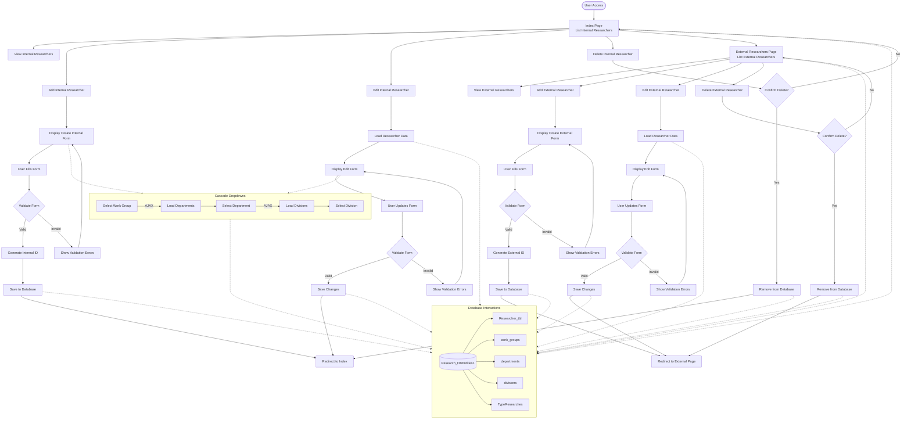
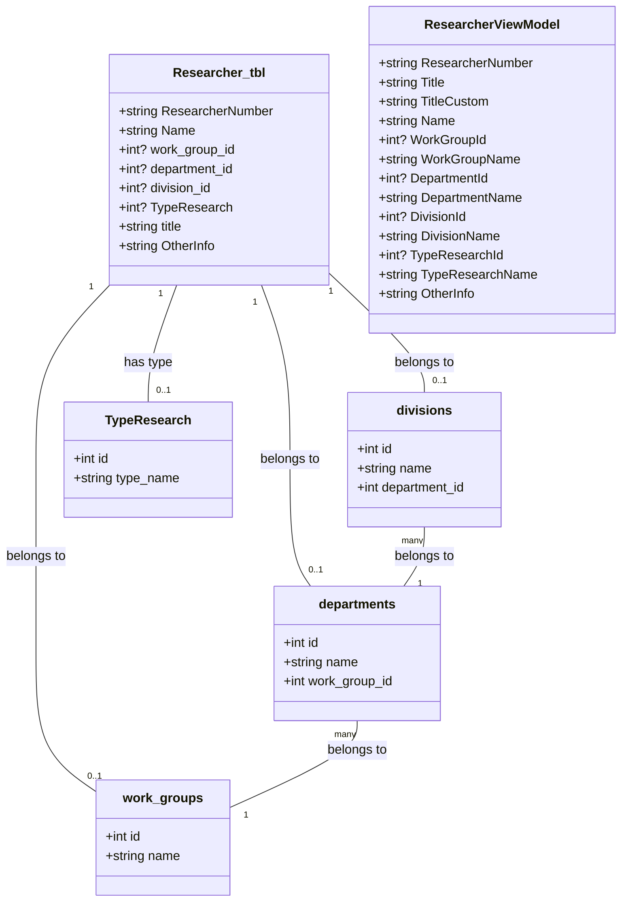
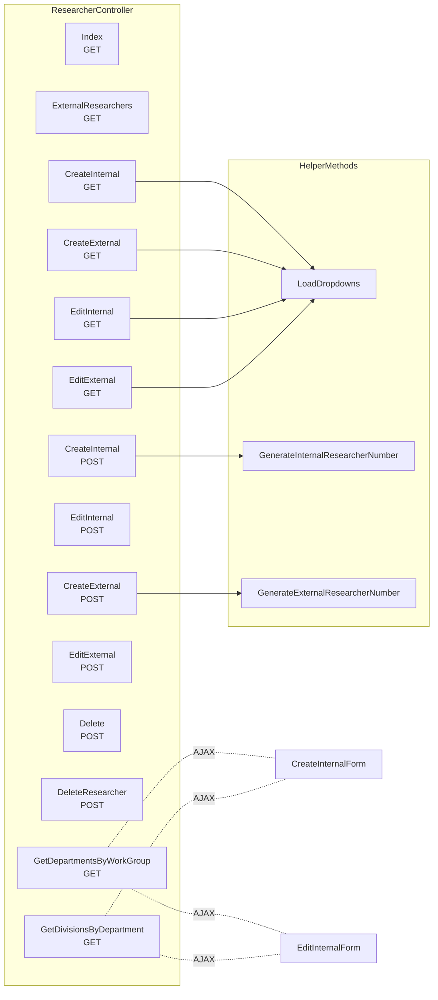
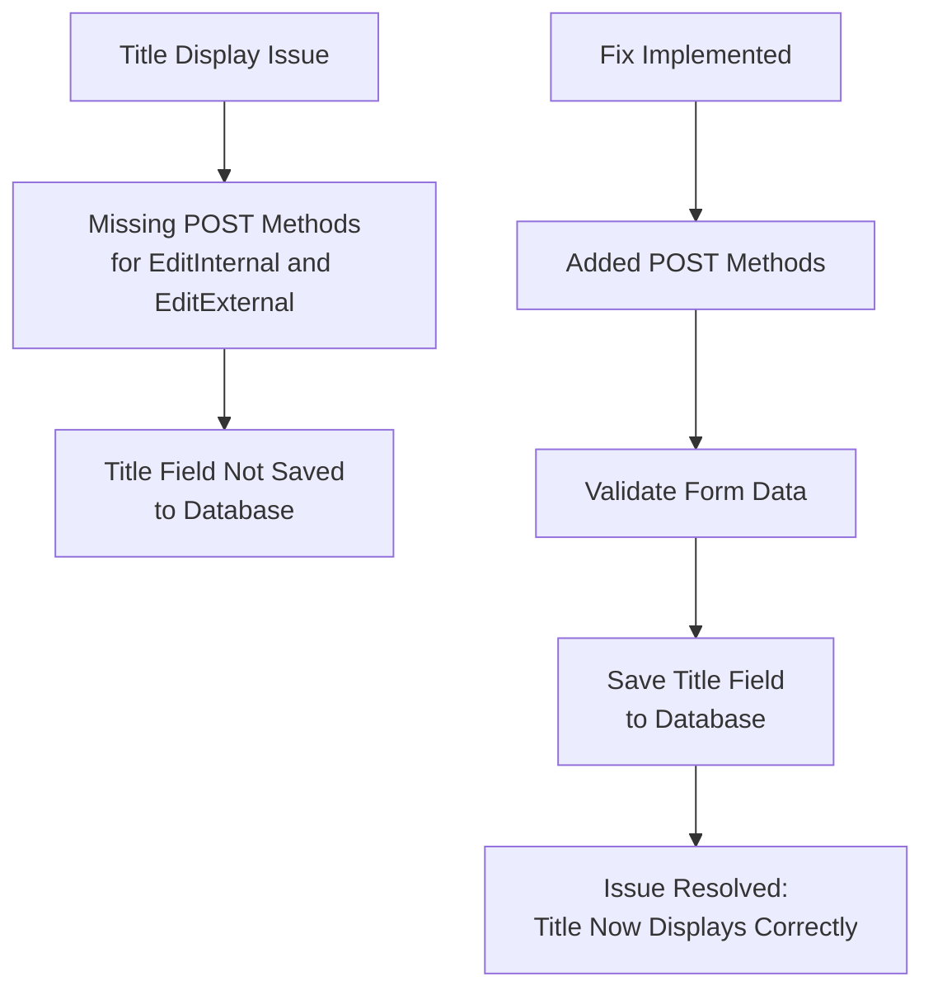

# TESTFRAMEWORK Application Flowchart

## Researcher Management Flow

```mermaid
flowchart TD
    %% Main Entry Points
    Start([User Access]) --> Index
    
    %% Index Pages
    Index[Index Page\nList Internal Researchers] --> ViewInternal[View Internal Researchers]
    Index --> AddInternal[Add Internal Researcher]
    Index --> EditInt[Edit Internal Researcher]
    Index --> DeleteInt[Delete Internal Researcher]
    Index --> ExternalPage[External Researchers Page]
    
    %% External Researchers
    ExternalPage[External Researchers Page\nList External Researchers] --> ViewExternal[View External Researchers]
    ExternalPage --> AddExternal[Add External Researcher]
    ExternalPage --> EditExt[Edit External Researcher]
    ExternalPage --> DeleteExt[Delete External Researcher]
    
    %% Create Internal Flow
    AddInternal --> CreateInternalForm[Display Create Internal Form]
    CreateInternalForm --> FillInternalForm[User Fills Form]
    FillInternalForm --> ValidateInternal{Validate Form}
    ValidateInternal -->|Valid| GenerateInternalID[Generate Internal ID]
    GenerateInternalID --> SaveInternal[Save to Database]
    SaveInternal --> RedirectToIndex[Redirect to Index]
    ValidateInternal -->|Invalid| ShowInternalErrors[Show Validation Errors]
    ShowInternalErrors --> CreateInternalForm
    
    %% Create External Flow
    AddExternal --> CreateExternalForm[Display Create External Form]
    CreateExternalForm --> FillExternalForm[User Fills Form]
    FillExternalForm --> ValidateExternal{Validate Form}
    ValidateExternal -->|Valid| GenerateExternalID[Generate External ID]
    GenerateExternalID --> SaveExternal[Save to Database]
    SaveExternal --> RedirectToExternal[Redirect to External Page]
    ValidateExternal -->|Invalid| ShowExternalErrors[Show Validation Errors]
    ShowExternalErrors --> CreateExternalForm
    
    %% Edit Internal Flow
    EditInt --> LoadInternalData[Load Researcher Data]
    LoadInternalData --> DisplayEditInternalForm[Display Edit Form]
    DisplayEditInternalForm --> UpdateInternalForm[User Updates Form]
    UpdateInternalForm --> ValidateInternalEdit{Validate Form}
    ValidateInternalEdit -->|Valid| SaveInternalChanges[Save Changes]
    SaveInternalChanges --> RedirectToIndex
    ValidateInternalEdit -->|Invalid| ShowInternalEditErrors[Show Validation Errors]
    ShowInternalEditErrors --> DisplayEditInternalForm
    
    %% Edit External Flow
    EditExt --> LoadExternalData[Load Researcher Data]
    LoadExternalData --> DisplayEditExternalForm[Display Edit Form]
    DisplayEditExternalForm --> UpdateExternalForm[User Updates Form]
    UpdateExternalForm --> ValidateExternalEdit{Validate Form}
    ValidateExternalEdit -->|Valid| SaveExternalChanges[Save Changes]
    SaveExternalChanges --> RedirectToExternal
    ValidateExternalEdit -->|Invalid| ShowExternalEditErrors[Show Validation Errors]
    ShowExternalEditErrors --> DisplayEditExternalForm
    
    %% Delete Flows
    DeleteInt --> ConfirmDeleteInternal{Confirm Delete?}
    ConfirmDeleteInternal -->|Yes| RemoveInternal[Remove from Database]
    RemoveInternal --> RedirectToIndex
    ConfirmDeleteInternal -->|No| Index
    
    DeleteExt --> ConfirmDeleteExternal{Confirm Delete?}
    ConfirmDeleteExternal -->|Yes| RemoveExternal[Remove from Database]
    RemoveExternal --> RedirectToExternal
    ConfirmDeleteExternal -->|No| ExternalPage
    
    %% Cascade Dropdowns
    subgraph CascadeDropdowns [Cascade Dropdowns]
        WorkGroup[Select Work Group] --> |AJAX| LoadDepartments[Load Departments]
        LoadDepartments --> Department[Select Department]
        Department --> |AJAX| LoadDivisions[Load Divisions]
        LoadDivisions --> Division[Select Division]
    end
    
    CreateInternalForm -.-> CascadeDropdowns
    DisplayEditInternalForm -.-> CascadeDropdowns
    
    %% Database Interactions
    subgraph Database [Database Interactions]
        DB[(Research_DBEntities1)]
        DB --> Researcher[Researcher_tbl]
        DB --> WorkGroups[work_groups]
        DB --> Departments[departments]
        DB --> Divisions[divisions]
        DB --> TypeResearch[TypeResearches]
    end
    
    SaveInternal -.-> Database
    SaveExternal -.-> Database
    SaveInternalChanges -.-> Database
    SaveExternalChanges -.-> Database
    RemoveInternal -.-> Database
    RemoveExternal -.-> Database
    LoadInternalData -.-> Database
    LoadExternalData -.-> Database
    Index -.-> Database
    ExternalPage -.-> Database
    CascadeDropdowns -.-> Database
```

## Data Model

```mermaid
classDiagram
    class Researcher_tbl {
        +string ResearcherNumber
        +string Name
        +int? work_group_id
        +int? department_id
        +int? division_id
        +int? TypeResearch
        +string title
        +string OtherInfo
    }
    
    class work_groups {
        +int id
        +string name
    }
    
    class departments {
        +int id
        +string name
        +int work_group_id
    }
    
    class divisions {
        +int id
        +string name
        +int department_id
    }
    
    class TypeResearch {
        +int id
        +string type_name
    }
    
    class ResearcherViewModel {
        +string ResearcherNumber
        +string Title
        +string TitleCustom
        +string Name
        +int? WorkGroupId
        +string WorkGroupName
        +int? DepartmentId
        +string DepartmentName
        +int? DivisionId
        +string DivisionName
        +int? TypeResearchId
        +string TypeResearchName
        +string OtherInfo
    }
    
    Researcher_tbl "1" -- "0..1" work_groups : belongs to
    Researcher_tbl "1" -- "0..1" departments : belongs to
    Researcher_tbl "1" -- "0..1" divisions : belongs to
    Researcher_tbl "1" -- "0..1" TypeResearch : has type
    departments "many" -- "1" work_groups : belongs to
    divisions "many" -- "1" departments : belongs to
```

## Controller Actions Flow

```mermaid
flowchart LR
    %% Main Controller Actions
    subgraph ResearcherController
        Index[Index\nGET]
        ExternalResearchers[ExternalResearchers\nGET]
        CreateInternal[CreateInternal\nGET]
        CreateInternalPost[CreateInternal\nPOST]
        CreateExternal[CreateExternal\nGET]
        CreateExternalPost[CreateExternal\nPOST]
        EditInternal[EditInternal\nGET]
        EditInternalPost[EditInternal\nPOST]
        EditExternal[EditExternal\nGET]
        EditExternalPost[EditExternal\nPOST]
        Delete[Delete\nPOST]
        DeleteResearcher[DeleteResearcher\nPOST]
        GetDepartmentsByWorkGroup[GetDepartmentsByWorkGroup\nGET]
        GetDivisionsByDepartment[GetDivisionsByDepartment\nGET]
    end
    
    %% Helper Methods
    subgraph HelperMethods
        LoadDropdowns[LoadDropdowns]
        GenerateInternalResearcherNumber[GenerateInternalResearcherNumber]
        GenerateExternalResearcherNumber[GenerateExternalResearcherNumber]
    end
    
    %% Relationships
    CreateInternalPost --> GenerateInternalResearcherNumber
    CreateExternalPost --> GenerateExternalResearcherNumber
    
    CreateInternal --> LoadDropdowns
    CreateExternal --> LoadDropdowns
    EditInternal --> LoadDropdowns
    EditExternal --> LoadDropdowns
    
    %% AJAX Relationships
    GetDepartmentsByWorkGroup -.- |AJAX| CreateInternalForm
    GetDepartmentsByWorkGroup -.- |AJAX| EditInternalForm
    GetDivisionsByDepartment -.- |AJAX| CreateInternalForm
    GetDivisionsByDepartment -.- |AJAX| EditInternalForm
```

## Title Display Issue Fix

```mermaid
flowchart TD
    Issue[Title Display Issue]
    Issue --> MissingPostMethods[Missing POST Methods\nfor EditInternal and EditExternal]
    MissingPostMethods --> DataNotSaved[Title Field Not Saved\nto Database]
    
    Fix[Fix Implemented]
    Fix --> AddPostMethods[Added POST Methods]
    AddPostMethods --> ValidateData[Validate Form Data]
    ValidateData --> SaveToDatabase[Save Title Field\nto Database]
    SaveToDatabase --> IssueResolved[Issue Resolved:\nTitle Now Displays Correctly]
```
