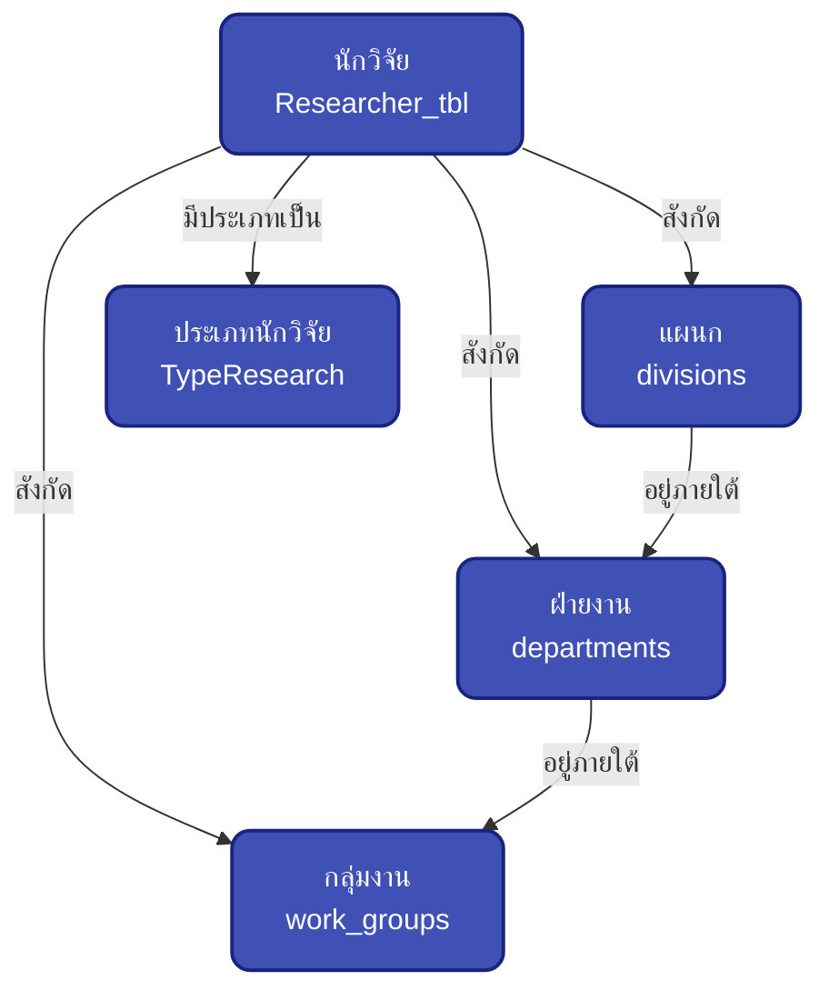
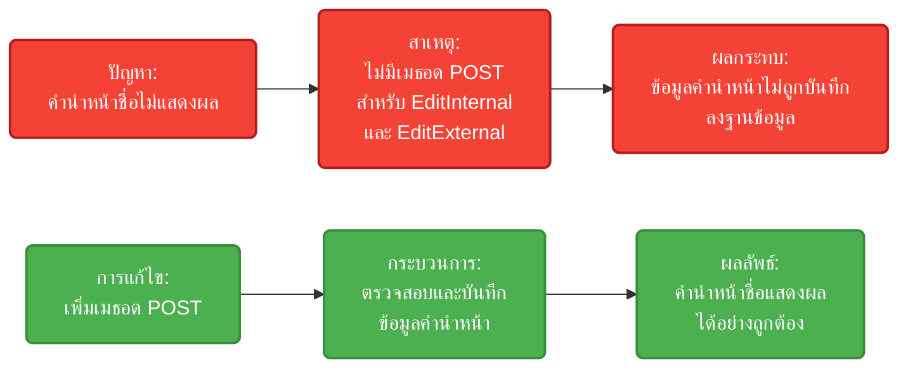
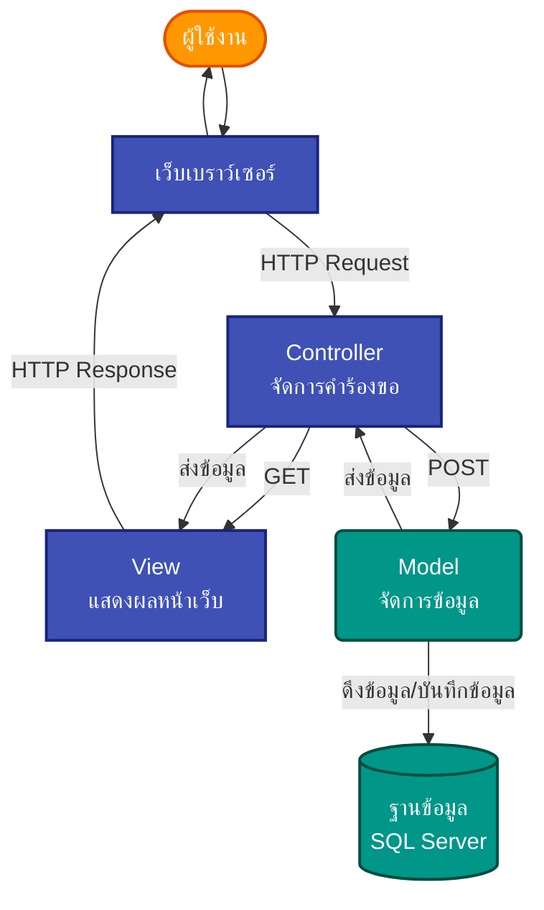

# TESTFRAMEWORK - แผนผังการทำงานของระบบ

## การจัดการข้อมูลนักวิจัย (Researcher Management)

```mermaid
flowchart TD
    %% Main nodes
    Start([เริ่มต้นใช้งานระบบ]) --> MainMenu[หน้าหลัก]
    
    %% Main menu options
    MainMenu --> InternalList[รายชื่อนักวิจัยภายใน]
    MainMenu --> ExternalList[รายชื่อนักวิจัยภายนอก]
    
    %% Internal researchers
    InternalList --> ViewInternal[ดูข้อมูลนักวิจัยภายใน]
    InternalList --> AddInternal[เพิ่มนักวิจัยภายใน]
    InternalList --> EditInternal[แก้ไขข้อมูลนักวิจัยภายใน]
    InternalList --> DeleteInternal[ลบข้อมูลนักวิจัยภายใน]
    
    %% External researchers
    ExternalList --> ViewExternal[ดูข้อมูลนักวิจัยภายนอก]
    ExternalList --> AddExternal[เพิ่มนักวิจัยภายนอก]
    ExternalList --> EditExternal[แก้ไขข้อมูลนักวิจัยภายนอก]
    ExternalList --> DeleteExternal[ลบข้อมูลนักวิจัยภายนอก]
    
    %% Add internal researcher flow
    AddInternal --> InternalForm[กรอกแบบฟอร์มข้อมูลนักวิจัยภายใน]
    InternalForm --> ValidateInternal{ตรวจสอบข้อมูล}
    ValidateInternal -->|ข้อมูลถูกต้อง| SaveInternal[บันทึกข้อมูลลงฐานข้อมูล]
    ValidateInternal -->|ข้อมูลไม่ถูกต้อง| ShowInternalErrors[แสดงข้อผิดพลาด]
    ShowInternalErrors --> InternalForm
    SaveInternal --> InternalList
    
    %% Add external researcher flow
    AddExternal --> ExternalForm[กรอกแบบฟอร์มข้อมูลนักวิจัยภายนอก]
    ExternalForm --> ValidateExternal{ตรวจสอบข้อมูล}
    ValidateExternal -->|ข้อมูลถูกต้อง| SaveExternal[บันทึกข้อมูลลงฐานข้อมูล]
    ValidateExternal -->|ข้อมูลไม่ถูกต้อง| ShowExternalErrors[แสดงข้อผิดพลาด]
    ShowExternalErrors --> ExternalForm
    SaveExternal --> ExternalList
    
    %% Edit internal researcher flow
    EditInternal --> LoadInternalData[โหลดข้อมูลนักวิจัยภายใน]
    LoadInternalData --> EditInternalForm[แก้ไขข้อมูลในแบบฟอร์ม]
    EditInternalForm --> ValidateEditInternal{ตรวจสอบข้อมูล}
    ValidateEditInternal -->|ข้อมูลถูกต้อง| UpdateInternal[อัปเดตข้อมูลในฐานข้อมูล]
    ValidateEditInternal -->|ข้อมูลไม่ถูกต้อง| ShowEditInternalErrors[แสดงข้อผิดพลาด]
    ShowEditInternalErrors --> EditInternalForm
    UpdateInternal --> InternalList
    
    %% Edit external researcher flow
    EditExternal --> LoadExternalData[โหลดข้อมูลนักวิจัยภายนอก]
    LoadExternalData --> EditExternalForm[แก้ไขข้อมูลในแบบฟอร์ม]
    EditExternalForm --> ValidateEditExternal{ตรวจสอบข้อมูล}
    ValidateEditExternal -->|ข้อมูลถูกต้อง| UpdateExternal[อัปเดตข้อมูลในฐานข้อมูล]
    ValidateEditExternal -->|ข้อมูลไม่ถูกต้อง| ShowEditExternalErrors[แสดงข้อผิดพลาด]
    ShowEditExternalErrors --> EditExternalForm
    UpdateExternal --> ExternalList
    
    %% Delete flows
    DeleteInternal --> ConfirmDeleteInternal{ยืนยันการลบ?}
    ConfirmDeleteInternal -->|ยืนยัน| RemoveInternal[ลบข้อมูลจากฐานข้อมูล]
    ConfirmDeleteInternal -->|ยกเลิก| InternalList
    RemoveInternal --> InternalList
    
    DeleteExternal --> ConfirmDeleteExternal{ยืนยันการลบ?}
    ConfirmDeleteExternal -->|ยืนยัน| RemoveExternal[ลบข้อมูลจากฐานข้อมูล]
    ConfirmDeleteExternal -->|ยกเลิก| ExternalList
    RemoveExternal --> ExternalList
    
    %% Styling
    classDef mainNode fill:#4CAF50,stroke:#388E3C,color:white,stroke-width:2px
    classDef formNode fill:#2196F3,stroke:#0D47A1,color:white,stroke-width:2px
    classDef decisionNode fill:#FFC107,stroke:#FF8F00,color:black,stroke-width:2px
    classDef actionNode fill:#9C27B0,stroke:#6A1B9A,color:white,stroke-width:2px
    classDef errorNode fill:#F44336,stroke:#B71C1C,color:white,stroke-width:2px
    
    class Start,MainMenu,InternalList,ExternalList mainNode
    class InternalForm,ExternalForm,EditInternalForm,EditExternalForm formNode
    class ValidateInternal,ValidateExternal,ValidateEditInternal,ValidateEditExternal,ConfirmDeleteInternal,ConfirmDeleteExternal decisionNode
    class SaveInternal,SaveExternal,UpdateInternal,UpdateExternal,RemoveInternal,RemoveExternal actionNode
    class ShowInternalErrors,ShowExternalErrors,ShowEditInternalErrors,ShowEditExternalErrors errorNode
```

## โครงสร้างข้อมูล (Data Structure)

## การแก้ไขปัญหาการแสดงคำนำหน้าชื่อ (Title Display Fix)

## ขั้นตอนการทำงานของระบบ (System Workflow)

