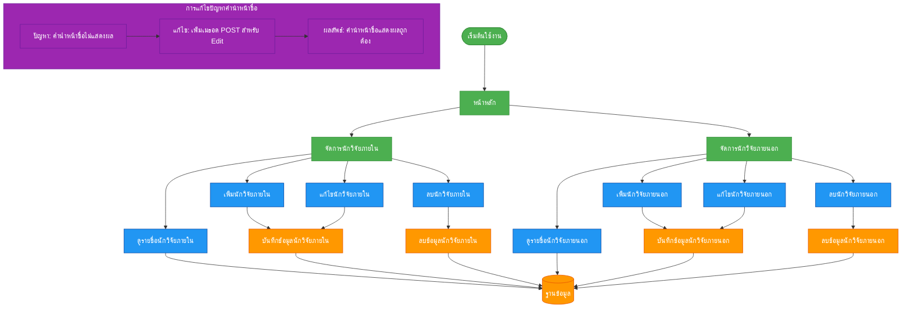
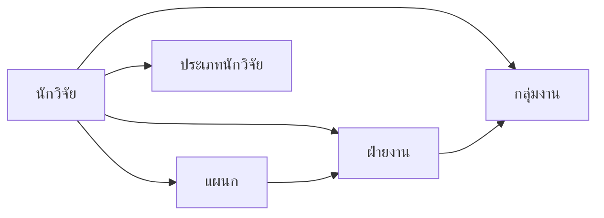

# แผนผังระบบ TESTFRAMEWORK (อย่างง่าย)

```mermaid
flowchart TD
    %% หน้าหลักและการเข้าถึง
    Start([เริ่มต้นใช้งาน]) --> MainMenu[หน้าหลัก]
    MainMenu --> Internal[จัดการนักวิจัยภายใน]
    MainMenu --> External[จัดการนักวิจัยภายนอก]
    
    %% การจัดการนักวิจัยภายใน
    Internal --> ViewInternal[ดูรายชื่อนักวิจัยภายใน]
    Internal --> AddInternal[เพิ่มนักวิจัยภายใน]
    Internal --> EditInternal[แก้ไขนักวิจัยภายใน]
    Internal --> DeleteInternal[ลบนักวิจัยภายใน]
    
    %% การจัดการนักวิจัยภายนอก
    External --> ViewExternal[ดูรายชื่อนักวิจัยภายนอก]
    External --> AddExternal[เพิ่มนักวิจัยภายนอก]
    External --> EditExternal[แก้ไขนักวิจัยภายนอก]
    External --> DeleteExternal[ลบนักวิจัยภายนอก]
    
    %% การเพิ่มและแก้ไขข้อมูล
    AddInternal & EditInternal --> SaveInternal[บันทึกข้อมูลนักวิจัยภายใน]
    AddExternal & EditExternal --> SaveExternal[บันทึกข้อมูลนักวิจัยภายนอก]
    
    %% การลบข้อมูล
    DeleteInternal --> RemoveInternal[ลบข้อมูลนักวิจัยภายใน]
    DeleteExternal --> RemoveExternal[ลบข้อมูลนักวิจัยภายนอก]
    
    %% ความสัมพันธ์กับฐานข้อมูล
    SaveInternal & SaveExternal & RemoveInternal & RemoveExternal --> Database[(ฐานข้อมูล)]
    ViewInternal & ViewExternal --> Database
    
    %% การแก้ไขปัญหาคำนำหน้าชื่อ
    subgraph TitleFix[การแก้ไขปัญหาคำนำหน้าชื่อ]
        Problem[ปัญหา: คำนำหน้าชื่อไม่แสดงผล] --> Solution[แก้ไข: เพิ่มเมธอด POST สำหรับ Edit]
        Solution --> Result[ผลลัพธ์: คำนำหน้าชื่อแสดงผลถูกต้อง]
    end
    
    %% สี
    classDef mainNode fill:#4CAF50,stroke:#388E3C,color:white
    classDef actionNode fill:#2196F3,stroke:#0D47A1,color:white
    classDef dataNode fill:#FF9800,stroke:#E65100,color:white
    classDef fixNode fill:#9C27B0,stroke:#6A1B9A,color:white
    
    class Start,MainMenu,Internal,External mainNode
    class ViewInternal,AddInternal,EditInternal,DeleteInternal,ViewExternal,AddExternal,EditExternal,DeleteExternal actionNode
    class SaveInternal,SaveExternal,RemoveInternal,RemoveExternal,Database dataNode
    class TitleFix,Problem,Solution,Result fixNode
```

## โครงสร้างข้อมูลหลัก

```mermaid
flowchart LR
    Researcher[นักวิจัย] --> WorkGroup[กลุ่มงาน]
    Researcher --> Department[ฝ่ายงาน]
    Researcher --> Division[แผนก]
    Researcher --> Type[ประเภทนักวิจัย]
    
    Department --> WorkGroup
    Division --> Department
```
